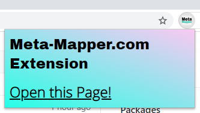

# Meta-Mapper-Chrome-Extension (MMCE)
This chrome extension just opens meta-mapper.com with the current URL for easily create 
nice thumbnails of any website. 



## Made with svelte and typescript 
Makes your live easier by using svelte and typescript. 

## Note
The extension folder must be in sync with the public folder 

## Build Extension 
```
npm install 
npm start build
```
Then just import the public folder as chrome extension in your chrome browser. 
open `chrome://extensions/` in your browser. 


